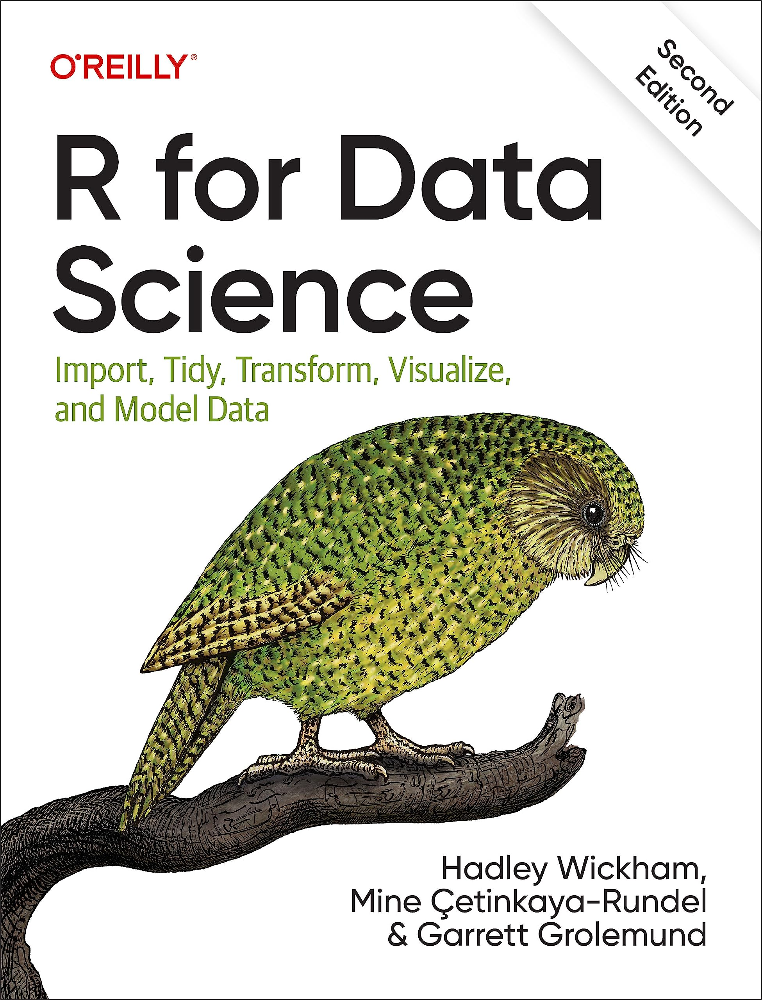
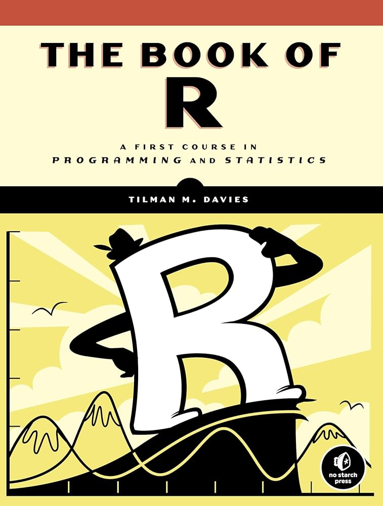
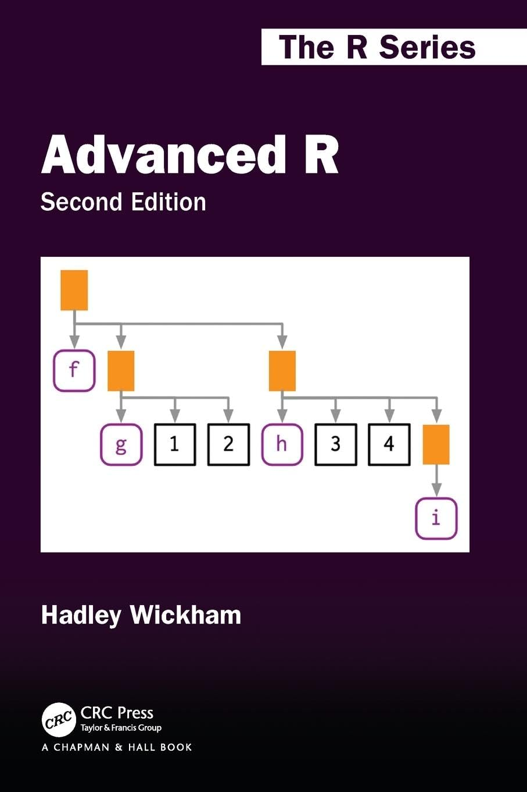
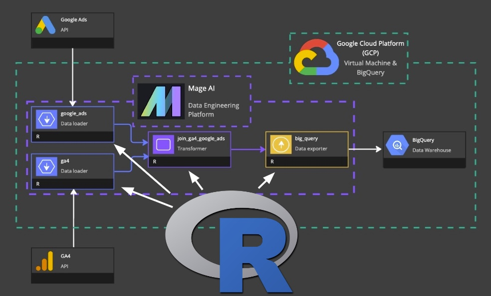
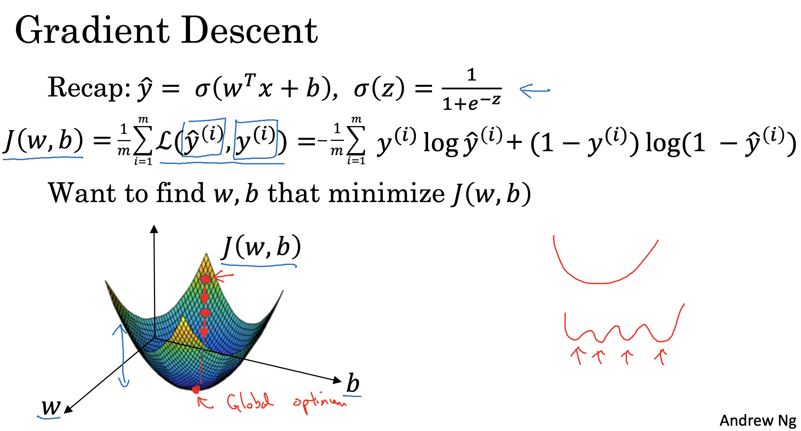
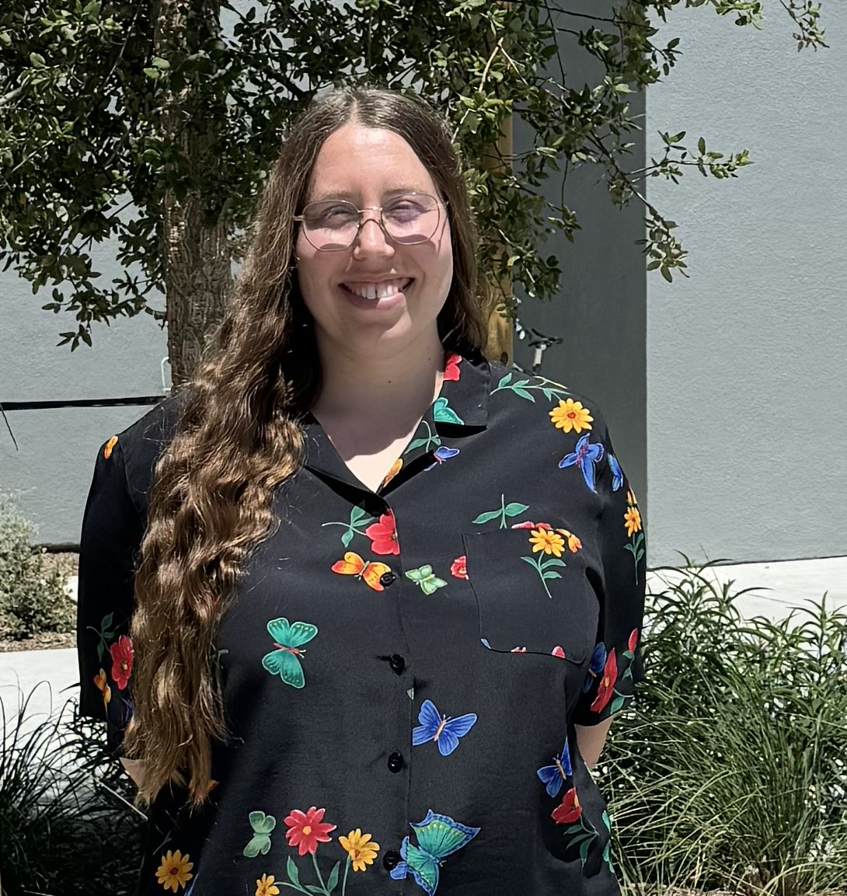

## **Question 1:** \n What is *Intermediate R*? {.text-panel-slide background-image="images/qm.jpeg" background-size="cover" background-position="center" background-color="#000" background-opacity="0.25"}

## Is it this?


```{r}
#| eval: false
#| echo: true

result <- data_main |>
  left_join(meta_info, by = "id") |>
  pivot_longer(cols = starts_with("score_"), names_to = "metric", values_to = "score") |>
  filter(!is.na(score)) |>
  group_by(group, metric) |>
  summarize(mean_score = mean(score), .groups = "drop") |>
  pivot_wider(names_from = metric, values_from = mean_score) |>
  inner_join(group_labels, by = "group") |>
  arrange(desc(overall))

```


## ... or this?

```{r}
#| eval: false
#| echo: true

result <- dt[
  score > 50 & !is.na(category),
  .(mean_score = mean(score), n = .N),
  by = .(category, region)
][order(-mean_score)
 ][, rank := .I
 ][n > 10]


```

## ... or this?

```{r}
#| eval: false
#| echo: true

  sidebarLayout(
    sidebarPanel(
      selectInput(
        inputId = "var",
        label = "Choose a variable:",
        choices = names(your_data_frame)
      )
    )
  )

```

```{r}
#| eval: false
#| echo: true

output$plot <- renderPlot({
  req(input$var)
  ggplot(data(), aes_string(input$var)) +
    geom_histogram()
})
```


## **Question 1:** \n What is *Introductory R*? {.text-panel-slide background-image="images/qm.jpeg" background-size="cover" background-position="center" background-color="#000" background-opacity="0.25"}

## Plenty of **resources**...

::::: {.columns layout-ncol="2"}
::: column
{fig-alt="Image of the cover of the textbook R for Data Science by Hadley Wickham." }
:::

::: column
{fig-alt="Image of the cover of the textbook Big Book of R by Tilman M. Davies"}
:::
:::::

## ... and generally **agreed-upon topics**.

::: {.nonincremental}

- Basics of coding

- Packages

- Objects

- Loading data

- Basic visualization

- Basic data wrangling

:::

## **Question 3:** \n What is *Advanced R*? {.text-panel-slide background-image="images/qm.jpeg" background-size="cover" background-position="center" background-color="#000" background-opacity="0.25"}

## Is it this?

{fig-align="center" fig-alt="Image of the cover of the textbook Advanced R by Hadley Wickham"}

. . .

(This book should be called **Advanced Computer Science in R**.)

## Is it this?

{height=80% width=80% fig-alt="A data engineering pipeline schematic, with an R logo pointing to all stages."}

## Is it this?

{fig-alt="A slide giving the mathematical derivation of Gradient Descent." fig-cap="img src: https://global.discourse-cdn.com"}


## There are **many** parallel *Intermediate R* paths! {.text-panel-slide background-image="images/ep.jpeg" background-size="cover" background-position="center" background-color="#000" background-opacity="0.25"}


## The structure as we see it:

```{r}
library(DiagrammeR)

grViz("
digraph flowchart {
  graph [rankdir = TB]  // left-to-right layout

  // Nodes
  node [shape = box, style = \"rounded,filled\", fontname = Helvetica]

  A [label = 'Intro R', fillcolor = 'palegreen1']
  B2 [label = 'R Programming', fillcolor = 'cadetblue1']
  B1 [label = 'Data Analysis', fillcolor = 'cadetblue1']
  B3 [label = 'Communication and Deliverables', fillcolor = 'cadetblue1']
  C2 [label = 'Advanced R (Wickham)', fillcolor = 'plum1']
  C1 [label = 'Advanced Statistical Computing', fillcolor = 'plum1']
  C3 [label = 'R in Production', fillcolor = 'plum1']
  
  // Rank groupings to align nodes horizontally
  {rank = same; B1; B2; B3}
  {rank = same; C1; C2; C3}

  // Edges
  A -> B1
  A -> B2
  A -> B3

  B1 -> C1
  B2 -> C2
  B3 -> C3
}
")
```

## What about this pathway?

```{r}
library(DiagrammeR)

grViz("
digraph flowchart {
  graph [rankdir = TB]  // left-to-right layout

  // Nodes
  node [shape = box, style = \"rounded,filled\", fontname = Helvetica]

  A [label = 'Intro R', fillcolor = 'palegreen1']
  A2 [label = 'Statistical Modeling (with R)', fillcolor = 'cadetblue1']
  A3 [label = 'Deep Learning (with R)', fillcolor = 'plum1']

  // Edges
  A -> A2
  A2 -> A3
}
")
```

. . .

Intermediate *statistics* is not Intermediate *R*.

. . .

**Take more statistics classes!!!**

## **Three Parallel Paths:** The *ABCs* of Intermediate R

:::::: {.columns layout-ncol="3"}
::: column
{.circular-img fig-align="center"} **A**nalyzing Complex Data
:::

::: column
{.circular-img fig-align="center"} **B**uilding open-source tools
:::

::: column
{.circular-img fig-align="center"} **C**ommunicating with professional deliverables
:::
::::::


# **Path A:** Analyzing Complex Data

{.circular-img fig-align="center"}

## **Path A:** Analyzing Complex Data

* Cleaning, Wrangling, Summarizing  
*long pipelines, vector functions in pipeline, functional programming*

* Even Messier Data  
*missingness, string cleaning with regex, datetimes, mismatched joins*

* Data from Dynamic Sources  
*XML, JSON, APIs, webscraping, databases*

* Statistical Analysis  
*hypothesis tests, simulation, bootstrapping, modeling*

# **Path B:** Building open-source tools

{.circular-img fig-align="center"}

## **Path B:** Building open-source tools

* Better Function Design  
*unit testing, debugging, validation, vectorization, tidy eval, OOP*

* Creating R Packages  
*folder structure, modular functions, unit tests, developer workflow, debugging*

* Speed and Benchmarking  
*benchmarking and profiling, parallelization, data.table, oom data*

# **Path C:** Communicating with Professional Deliverables

{.circular-img fig-align="center"}

## **Path C:** Communicating with Professional Deliverables

* Advanced Data Visualization  
*visualization principles, new geoms, extensions of ggplot, animation, interactivity, maps*

* Dashboards, Websites, Deliverables  
*advanced quarto, dashboards, websites, branding*

* Interactivity  
*Shiny, modules, dashboards, publishing apps, packaging apps*

## **Question:** How did *you* level up after your *introductory* class/workshop/book? {.text-panel-slide background-image="images/qm.jpeg" background-size="cover" background-position="center" background-color="#000" background-opacity="0.25"}

## How did you get to "Intermediate"?

. . .

</br>

"I took a *class*, read a *textbook*, or attended a *workshop*."

</br>

. . .

</br>

"I tried out *fun little projects* I saw online or came up with for myself."

</br>

. . .

</br>

"I was forced to *apply my skills* in a job."

</br>

## *Intermediate R* needs a **motivating project** with **guided practice** {.text-panel-slide background-image="images/ep.jpeg" background-size="cover" background-position="center" background-color="#000" background-opacity="0.25"}

## Practice exercises with *satisfying outcomes*

* *Introductory* R exercises are often about solving **one small problem** to practice
a **specific skill**.

* *Intermediate* R exercises are about **combining many skills** to achieve a **tangible end goal**.

* Post-introductory practice exercises must build to a **known, achieveable,  and satisfying outcome**.

## Example: Matrix Algebra

```
Perform the following steps to discover the secret picture!

1. Matrix-multiply M by A.

2. Multiply every row of M elementwise by x. 

3. Make a diagonal matrix called Y whose diagonal values are the elements of the vector y.  Matrix-multiply the inverse of Y by M.

4.  Calculate the determinant of B.  Add this scalar to every element of M.

5. Use eigen() to find the eigenvalues and eigenvectors of B.  Find the sum of the third eigenvector of B. Multiply every element of M by this scalar.

6. Multiply each element of M by the corresponding element of the matrix formed by (xy')'.

7. Find the singular value decomposition H = UDV' using `svd()`.  Multiply each element of M by each element of 100*U. 

8. Calculate the sum of the singular values of H.  Divide *every* element of M by this scalar.

```

## Example: Matrix Algebra

```
Run the following code to plot your result.  If it does not look like a real photographic image, something has gone wrong - go back and check your steps.
```

```{r}
#| eval: false
#| echo: true

image(M, col = gray((1:100)/100), asp = 1, axes = FALSE)
```

## Example: Matrix Algebra


## **Goal-oriented** exercises, like puzzles, provide both *motivation* and *immediate feedback*. {.text-panel-slide background-image="images/ep.jpeg" background-size="cover" background-position="center" background-color="#000" background-opacity="0.25"}

## *Structured* Project Progress

* "Put it all together at the end" does not reinforce the **use cases** for the new skills.

* *Every* new skill acquired should be *immediately* matched with an application in the **project context**.

* Ask regularly: "What have you gained with all your hard work?"

* Regular **project checkpoints** as you go.


## Common-ish Data Anchor

* The **observational units** are *countries* (or other geopolitical region) by *year*; or, your dataset can be aggregated to these observational units.

* The data contains at least 500 rows, covering at least *50 countries* and at least *10 years*.

* The data contains at least one *categorical* variables, at least one *quantitative* variables, and at least one *string, label, or name* variable.

* The data contains some *missing data*, but not extensive missing sections.

## Common-ish Data Anchor example: Measles (TidyTuesday)

```{r}
#| echo: false
#| message: false

readr::read_csv('https://raw.githubusercontent.com/rfordatascience/tidytuesday/main/data/2025/2025-06-24/cases_year.csv') |>
  dplyr::filter(country %in% c("Botswana", "Canada"))

```

## **Structured** Project Steps

* Summarize all the *quantitative variables* for each *year*, then pivot wider to make a human-readable table.

* Pull GDP data by *country and year* from an API

* Webscrape demographic data by *country and year* from Wikipedia

* Make an animated plot showing the change in a *quantitative variable* over the *years*
for one *country*.

* Add an interactive element to a dashboard that filters the data by a *categorical variable* before plotting.

## Project Deliverables

:::::: {.columns layout-ncol="3"}
::: column
{.circular-img fig-align="center"} A blog-post style **report**
telling a story with data.
:::

::: column
{.circular-img fig-align="center"} A data-centric **R Package** that streamlines analysis steps.
:::

::: column
{.circular-img fig-align="center"} A polished **Shiny dashboard**
that facilitates data insights and exploration.
:::
::::::

## **Scaffolded** projects with **regular updates** illustrate the **uses** of what you have learned. {.text-panel-slide background-image="images/ep.jpeg" background-size="cover" background-position="center" background-color="#000" background-opacity="0.25"}

 
# Intermediate R has  </br> **multiple paths**, </br> requires practice with </br> **specific goals**, </br> and needs a </br> **motivating project**. {background-image="images/lb.jpeg" background-size="cover" background-position="center" background-color="#000" background-opacity="0.25"}


## Whose work is this?

:::::: {.columns layout-ncol="3"}
::: column
{.circular-img fig-align="center"} Allison Theobold

{.circular-img fig-align="center"} Charlotte Mann
:::

::: column
{.circular-img fig-align="center"} Emily Robinson

{.circular-img fig-align="center"} Zoe Rehnberg
:::

::: column
{.circular-img fig-align="center"} Julia Schedler

{.circular-img fig-align="center"} Tyson Barrett
:::
::::::

Funding from the **Noyce School of Computing** at Cal Poly.

# {background-image="images/elephant.jpg" background-size="contain" background-position="center}


# {background-image="https://specials-images.forbesimg.com/imageserve/659c2c97b23e65b7a7ce90e1/Clara-Peller-Asking-Famous-Question/960x0.jpg" background-size="contain" background-position="center}

## Where you can find our materials:

For the **complete, polished course** that we just ran:

::: {.fs-4}
[https://atheobold.github.io/advanced-R-website/](atheobold.github.io/advanced-R-website/)
:::


For the **work-in-progress** public-facing "Playbook":

::: {.fs-4}
[https://kbodwin.github.io/intermediate-r-playbook](kbodwin.github.io/intermediate-r-playbook)
:::


## Thank you!

- [Find me on BlueSky](bsky.app/profile/kellybodwin.com)

- [Find me on LinkedIn](https://www.linkedin.com/in/kelly-bodwin-9009061a/)

- [Find me on Mastodon](@kellybodwin@fosstodon.org)

- Find these slides: [https://bit.ly/Int-R-Posit](bit.ly/Int-R-Posit)

- Thanks to:

  - My awesome collaborators
  - Noyce School of Computing
  - Everyone who shares their great R materials online!
  

