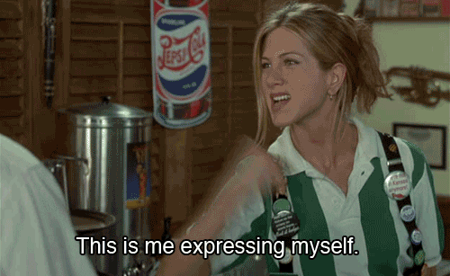
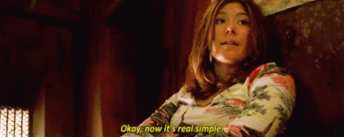

```{r setup, include=FALSE}
options(htmltools.dir.version = FALSE)

library(flair)
library(icon)
library(emo)

```

```{r xaringan-themer, include = FALSE}
library(xaringanthemer)
library(tidyverse)
mono_light(
  base_color = "#26116c",
  text_bold_color = "#fd5e53",
  title_slide_text_color = "#fff8e7",
  background_color = "#fff8e7",
  header_font_google = google_font("Roboto"),
  text_font_google   = google_font("Roboto Condensed"),
  code_font_google   = google_font("Droid Mono")
)
```

```{css, echo = FALSE}
img {
  height: 400px;
}

.remark-code {
  font-size: 30px;
}

.remark-slide {
  background-size: cover;
}
```

---
class: center, middle

# **Thesis:**

<br>

--

# Some things are hard (especially for teachers).

<br>

--

# Let's use **R** to make them easier.

---
class: inverse, center, middle

# Hard for **everyone**:

## Formatting source code for presentations

---

```{r, echo = FALSE}
decorate('
my_presentation %>%
  highlight_code("this is important") %>%
  get_frustrated() %>%
  not_reproducible()
  ', eval = FALSE) %>%
  flair_all(size="40")%>%
  flair("this is important") %>%
  flair_funs(background = "pink") %>%
  flair("highlight_code", background = "light green") %>%
  flair("my_presentation", color = "cornflowerblue")
```

---
class: center

## Me trying to highlight my code examples for lecture...


---
class: center, middle


## `r emo::ji("point_right")` github.com/kbodwin/flair

---
class: inverse, center
# How to add flair to your code


---
# **Step One:**
## Regular ol' code chunk (with a name)

````

```{r how_to_pipe, include = FALSE}`r ''`

iris %>%
  group_by(Species) %>%
  summarize(mean(Sepal.Length))

```

````


```{r how_to_pipe, include = FALSE}

iris %>%
  group_by(Species) %>%
  summarize(mean(Sepal.Length))

```

```{r meta, include = FALSE}
decorate("how_to_pipe") %>%
  flair("%>%") %>%
  flair_funs(color = "cornflowerblue") %>%
  flair_args(color = "indianred")
```


---
# **Step Two:**
## Reference chunk by name with `decorate`

```{r, echo = FALSE}
decorate("meta", eval = FALSE, echo = 1) %>%
  flair("decorate")

```

---
# **Step Three:**


---

# **Step Three:**
## Add your flair with `flair_*` functions

```{r, echo = FALSE}
decorate("meta", eval = FALSE) %>%
  flair_rx("flair(_[:alpha:]+)*")

```

---
# **Step Four**
## There is no step 4.  You're done!


```{r, echo = FALSE}
decorate("how_to_pipe") %>%
  flair("%>%") %>%
  flair_funs(color = "cornflowerblue") %>%
  flair_args(color = "indianred")
```

---
class: inverse, center, middle

# Speed **FAQ**

---
# **FAQ:**
## Does this work in `ioslides`, `xaringan`, etc?


</img>

---
# **FAQ:**
## Does this work in `ioslides`, `xaringan`, etc?

Sometimes we need to hard-code the formatting.  

Easily done if you tell me the doc type.

File issue on GitHub to request more functionality.

---
# **FAQ:**
## What happens when you run in console/Rmd source?

--

1. Code actually runs invisibly -> can create objects!

--

2. Source code w/flair is previewed in viewer pane.

---
# **FAQ:**
## Does this work with LaTeX knitting?

--

## Not yet, but it is high priority!

---
# **FAQ:**
## When will this be on CRAN?

--
<strike> two months ago </strike>
--


---
class: inverse, center, middle
# Find the package:

## **github.com/kbodwin/flair**

# Find me:

## **@KellyBodwin**

## **kelly-bodwin.com**

---
class: inverse, center, middle

# **Sneak Preview**
## Infant package edition

---
class: inverse, center, middle

# Hard for **very basic R users**:


### Making a simple Shiny app

---
class: center,middle


---

## At first, teachers get excited about the potential for Shiny apps in the classroom/research...


---
## But if they only barely know R, it's a lot to take in.


---
class: inverse
# **Our idea:** 
## Wrappers to simplify Shiny

```{r, eval = FALSE}
create_app("basic_app",
           layout = "default", 
           data = "faithful") %>%
  add_histogram(x = "<text>", 
                bins = "<slider>",
                title = "Old Faithful")
```

---
# How you can help:
## **kelly.bodwin+shindig@gmail.com**



---
class: inverse, center, middle

# Hard for **people who hate inefficiency**:

<br>

--

### Updating course materials every year

<br>

--

### Writing exam solutions

<br>

--

### etc etc etc

---
class: center, middle


---
class: inverse, center, middle

# **Our idea:**

## Take advantage of templating in RS projects and R Markdown

---
background-image: url("templar_project.png")
background-position: center
background-size: fill

---
class: inverse, center, middle
# **Our idea:**
## Take advantage of templating in RS projects and R Markdown
## Use R and yaml to automate "filler"

---
background-image: url("templar_syllabus.png")
background-position: center
background-size: cover
---
class: inverse, center, middle
# Find the package:

## **github.com/kbodwin/flair**

# Find me:

## **@KellyBodwin**

## **kelly-bodwin.com**

# Take hex stickers!
